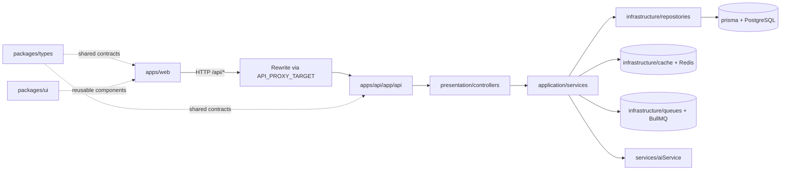

# Folder Structure and Linking

This document explains the repository folder structure and how modules are linked at runtime and development time.

---

## 1) Top-level structure

```text
task-platform/
├─ apps/
│  ├─ api/                # Backend API app (Next.js API routes + layered backend)
│  └─ web/                # Frontend app (Next.js UI)
├─ packages/
│  ├─ types/              # Shared TypeScript types/contracts
│  └─ ui/                 # Shared UI components
├─ prisma/                # DB schema, migrations, seed
├─ docker/                # Dockerfiles for api and web
├─ docs/                  # Project documentation set
├─ config/                # Workflow and dropdown configuration artifacts
├─ scripts/               # Utility scripts/docs
├─ tests/                 # Test-related docs/helpers at root level
├─ docker-compose.yml     # Full stack container orchestration
└─ package.json           # Workspace scripts and npm workspaces config
```

---

## 2) Folder purpose by area

## `apps/web`

- Contains user-facing UI (pages, components, hooks, store, API client).
- Handles navigation, forms, dashboard views, admin views.
- Sends API requests to `/api/*` (rewritten to API app target).

## `apps/api`

- Contains backend endpoints and layered architecture:
  - `app/api/**/route.ts` for endpoint entrypoints
  - `presentation/` for controllers/middlewares/http response shaping
  - `application/` for business services/use cases
  - `infrastructure/` for repositories, DB/Redis/queue/config/logger
  - `domain/` for domain entities and rules

## `packages/types`

- Shared DTOs/contracts consumed by web and API to reduce mismatch.

## `packages/ui`

- Shared reusable UI components and primitives.

## `prisma`

- `schema.prisma`, migrations, and seed scripts.
- Source of truth for relational model evolution.

## `docs`

- Architecture, runbooks, feature docs, and flow docs.
- Onboarding and operational reference point.

## `docker` + `docker-compose.yml`

- Container build definitions and runtime orchestration.
- Runs PostgreSQL, Redis, API, and Web in local containerized mode.

---

## 3) Runtime linking flow (how folders connect)



---

## 4) Development-time linking

## npm workspaces linking

Root `package.json` defines workspaces:

- `apps/*`
- `packages/*`

This enables:

- shared dependency management
- local package linking without publishing
- consistent root scripts (e.g., `dev`, `build`, `test`)

## Shared package usage

- Web imports shared contracts from `packages/types`.
- API can return DTOs aligned with same shared contracts.
- Web imports reusable UI from `packages/ui` where applicable.

---

## 5) API linking path (request lifecycle)

1. `apps/web` triggers request via API client.
2. Request routes to `apps/api/src/app/api/**/route.ts`.
3. Route delegates to controller in `presentation/controllers`.
4. Controller invokes service in `application/services`.
5. Service calls repository in `infrastructure/repositories`.
6. Repository persists/fetches data through Prisma (`prisma` schema).
7. Optional side paths: Redis cache/rate-limit, queue jobs, AI service.

---

## 6) Config linking

- `.env` controls runtime links:
  - `API_PROXY_TARGET` links web proxy to API host
  - `DATABASE_URL` links API to PostgreSQL
  - `REDIS_URL` links API to Redis
  - AI envs link API to local/hosted AI provider
- `config/workflow.json` and `config/dropdowns.json` support configurable behavior.

---

## 7) Quick reference: where to change what

- UI behavior: `apps/web/src/components`, `apps/web/src/app`
- API endpoint contract: `apps/api/src/app/api/**` + controllers
- Business rules: `apps/api/src/application/services`
- Persistence logic: `apps/api/src/infrastructure/repositories`
- DB model: `prisma/schema.prisma`
- Workflow/UI admin config behavior: admin pages + workflow/ui-config controllers/services

---

## Summary

The repository is organized for clear separation of concerns: **UI in `apps/web`, backend logic in `apps/api`, shared contracts in `packages/*`, and infrastructure/docs at root**. Linking is explicit through workspace packages, runtime environment variables, and layered request flow.
