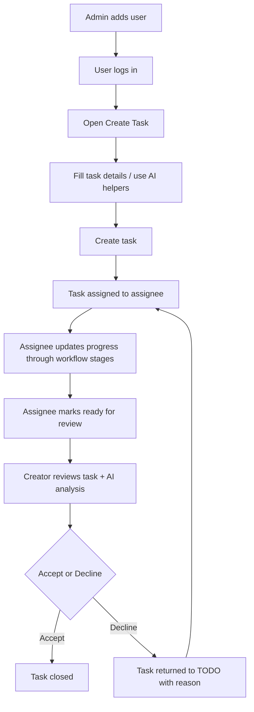

# Functional Flow

This document explains the practical user flow in Task Platform: **add user, login, create task, execute task, and close via approval**.

---

## 1) High-level business flow

---

## 2) User onboarding flow (Add User)

## Actor
- Admin

## Steps
1. Admin opens user management/register flow.
2. Admin (or authorized flow) creates a new user account with role/team.
3. System validates user fields and uniqueness.
4. User record is saved.
5. New user can now authenticate and access role-allowed screens.

## Outcome
- User is onboarded and mapped to permissions/team context.

---

## 3) Authentication flow (Login)

## Actor
- User (Creator / Assignee / Admin)

## Steps
1. User opens login page.
2. User submits credentials.
3. API validates credentials and role.
4. System issues auth token/session context.
5. User is redirected to role-relevant landing page.

## Outcome
- Authenticated user can call protected APIs and use allowed features.

---

## 4) Task creation flow

## Actor
- Creator

## Steps
1. Creator opens **Create Task** screen.
2. Creator enters title/description and optional metadata (priority, due date, assignee, team).
3. Optional AI assists:
   - Generate summary
   - Parse natural language prompt
   - Suggest priority
   - Detect duplicate issues before final submit
4. Creator clicks **Create Issue**.
5. API validates payload and persists task.
6. Background/async processes can run (e.g., categorization).

## Outcome
- New task is available in creator and assignee views.

---

## 5) Assignee execution flow (Work Task)

## Actor
- Assignee

## Steps
1. Assignee opens **My Dashboard** (Kanban) to view assigned tasks.
2. Assignee picks task and updates stage/status through configured workflow.
3. Assignee adds implementation comments/notes.
4. Assignee can run AI analysis in task details:
   - Root cause analysis
   - Permanent resolution suggestions
5. Assignee marks task as completed/submitted for review.

## Outcome
- Task reaches **Pending Approval** state for creator review.

---

## 6) Creator review flow (Approve / Decline)

## Actor
- Creator

## Steps
1. Creator opens **Pending Approval** task.
2. Creator reviews:
   - Assignee updates/comments
   - AI root-cause analysis
   - Prevention/resolution notes
3. Creator decides:
   - **Accept**: task is closed
   - **Decline**: task goes back to TODO/in-progress path with decline reason

## Outcome
- Controlled closure with quality gate; declined tasks re-enter execution loop.

---

## 7) Admin governance flow

## Actor
- Admin

## Steps
1. Configure team workflows (stages and stage kinds).
2. Configure UI field visibility/order per screen.
3. Review AI insights dashboard (adoption and category metrics).
4. Adjust governance settings based on usage and quality trends.

## Outcome
- Platform behavior remains aligned with team process and compliance needs.

---

## 8) End-to-end flow summary (simple)

1. Add user
2. Login
3. Create task
4. Assign task
5. Execute task
6. Analyze with AI (optional but recommended)
7. Submit for review
8. Approve or decline
9. Close task or rework loop

---

## 9) Key checkpoints

- Validation at input/API boundaries
- Auth + RBAC for protected operations
- CSRF + rate limiting for secure endpoint usage
- Approval gate before closure
- Auditability through comments/history and admin insights

---

## 10) Two-user UAT workflow (recommended test script)

Use this exact flow for functional testing and demos.

### Setup

1. Create two users:
   - **user1** = creator
   - **user2** = assignee
2. Ensure `user2` belongs to the target delivery team used during assignment.

### Phase A: Creator flow (`user1`)

1. Log in as `user1`.
2. Open **Create Task**.
3. Enter task text and use AI-assisted generation.
4. Review AI judgment for:
   - team recommendation,
   - priority recommendation.
5. Confirm duplicate pre-check behavior:
   - if similar task exists, system warns in advance and shows details.
6. Assign task to `user2` team and create issue.
7. Open **My Created Tasks** and verify:
   - new task appears,
   - view/edit/delete actions work,
   - duplicate behavior can be tested by creating similar tasks,
   - filter and sort controls work as expected.

### Phase B: Assignee flow (`user2`)

1. Log in as `user2`.
2. Open **My Dashboard** (Kanban).
3. Confirm assigned task is visible.
4. Drag task through relevant workflow stages.
5. Open task details and add comments/findings.
6. Use AI analysis on latest details:
   - root-cause analysis,
   - prevention/recommended actions.
7. Save notes and move task to completion/**Pending Approval**.

### Phase C: Creator decision (`user1`)

1. Log back in as `user1`.
2. Open **My Created Tasks**.
3. Review assignee updates, comments, and AI notes.
4. Decide:
   - **Accept** → task closes.
   - **Decline** → reason is mandatory, task returns to execution loop.

### Expected result

- Creator remains the final decision authority for closure.
- Decline path is traceable with reason and rework loop.
- AI assistance improves task quality without bypassing governance.
