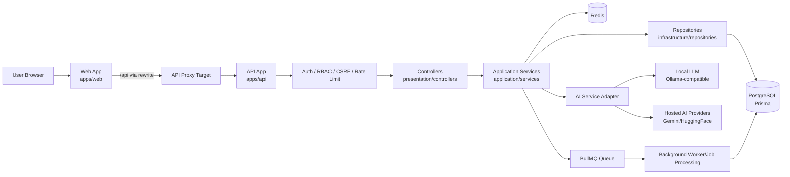
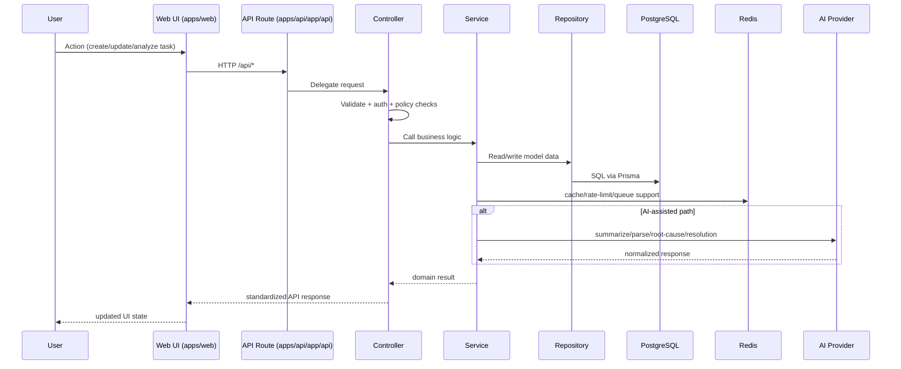

# Project Architecture Flow Chart

This document provides a visual architecture flow for Task Platform.

---

## 1) End-to-end architecture flow (system view)

---

## 2) Request processing flow (runtime view)

---

## 3) Layer legend

- **Web App**: user interface, forms, dashboards, admin screens.
- **API App**: route entrypoints for auth, tasks, AI, admin.
- **Controllers**: input validation, response shaping, middleware orchestration.
- **Services**: business rules and orchestration (including AI calls).
- **Repositories**: persistence boundary to PostgreSQL through Prisma.
- **Redis/BullMQ**: cache, rate limits, and async/background jobs.
- **AI Providers**: local-first AI with hosted fallback options.

---

## 4) Key architecture characteristics

- Clean layered backend for maintainability.
- Monorepo with shared types for API/Web consistency.
- Secure-by-default controls on protected endpoints.
- AI integrated as optional assistive capability, not a hard dependency.
- Async offloading for operations that should not block core UX.
