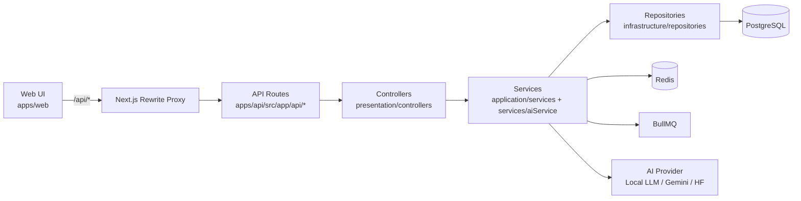
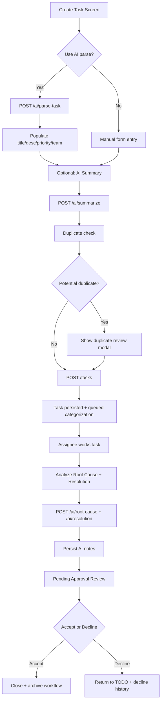

# Task Platform — Complete Project Documentation

## 1) Project overview

Task Platform is a full-stack task lifecycle system with AI-assisted task authoring, analysis, and operational workflow controls.

- **Frontend**: Next.js (App Router), Tailwind, SWR, React Hook Form
- **Backend**: Next.js API routes, clean layering (presentation → application → infrastructure)
- **Data**: PostgreSQL (Prisma), Redis (cache/queue/rate-limit)
- **Queue**: BullMQ for reminders / async categorization
- **AI**: Local-first provider mode (`local-llm`) with optional Gemini/HuggingFace fallback

---

## 2) Architecture (high-level)

### Layer responsibilities

- **Web UI (`apps/web`)**: screens, forms, SWR data loading, client-side validation and UX
- **API routes (`apps/api/src/app/api`)**: endpoint entry points
- **Controllers (`presentation/controllers`)**: request validation, auth/CSRF/rate limit orchestration, response shaping
- **Services (`application/services`, `services/aiService.ts`)**: business logic and AI orchestration
- **Repositories (`infrastructure/repositories`)**: Prisma DB operations

---

## 3) UI → REST → Backend structure

### Frontend to backend path

1. UI calls `api` client (`apps/web/src/lib/api-client.ts`) with `baseURL='/api'`
2. Web app rewrite forwards to API app (`API_PROXY_TARGET`)
3. Route handler (`apps/api/src/app/api/**/route.ts`) delegates to controller
4. Controller validates payload (Zod), applies middleware checks
5. Service executes domain logic
6. Repository persists/fetches data via Prisma
7. Controller returns normalized DTO response

### Important endpoint groups

- **Auth**: `/api/auth/*`
- **Tasks**: `/api/tasks`, `/api/tasks/:id`, comments, status, creator review
- **AI**: `/api/ai/summarize`, `/api/ai/parse-task`, `/api/ai/root-cause`, `/api/ai/resolution`, etc.
- **Admin**: `/api/admin/workflows`, `/api/admin/ui-config`, `/api/admin/ai-insights`

---

## 4) Functional flow chart (primary user flow)

---

## 5) Core functionality

- Authentication + authorization (JWT + RBAC)
- Team-based task assignment and lifecycle workflow
- Create/edit/delete task by creator with policy checks
- Assignee status progression + creator approval gate
- Comment history and decline history
- Duplicate detection with heuristic + optional semantic AI scoring
- AI-assisted features:
  - parse natural-language task
  - summary generation
  - priority suggestion
  - root-cause analysis
  - prevention/resolution planning

---

## 6) Admin functionality

### Admin pages

- `apps/web/src/app/admin/workflows/page.tsx`
  - Team workflow creation, stage ordering (drag/drop), stage kind assignment
- `apps/web/src/app/admin/ui-config/page.tsx`
  - Field visibility and order by screen (`create-task`, `task-details`, `my-created-grid`)
- `apps/web/src/app/admin/ai-insights/page.tsx`
  - AI adoption metrics and category distribution

### Admin API controls

- Workflow management (`workflow.controller.ts`)
- UI config management (`ui-config.controller.ts`)
- AI insights aggregation (`ai.controller.ts` admin endpoint)

---

## 7) Installation guide (local/dev)

## Prerequisites

- Node.js 20+
- npm 10+
- PostgreSQL
- Redis
- (optional) Ollama for local AI

## Steps

1. Copy env
   - `.env.example` → `.env`
2. Install dependencies
   - `npm install`
3. Start infra (if local services not already running)
   - PostgreSQL and Redis
4. Prisma setup
   - `npm run prisma:generate`
   - `npm run prisma:migrate`
   - `npm run prisma:seed`
5. Run apps
   - `npm run dev`
   - web: `http://localhost:3000`
   - api: `http://localhost:3001`

### Local AI mode (recommended current setup)

In `.env`:

- `AI_FALLBACK_PROVIDER=local`
- `LOCAL_LLM_MODEL=qwen2.5:0.5b` (or your preferred local model)
- `LOCAL_LLM_API_URL=http://127.0.0.1:11434/api/generate`

Verify:

- `GET http://127.0.0.1:11434/api/tags`
- `GET http://localhost:3001/api/health` (shows AI mode + local readiness)

---

## 8) Installation guide (Docker)

`docker-compose.yml` services:

- `postgres` (5432)
- `redis` (6379)
- `api` (3001)
- `web` (3000)

### Run

1. Ensure `.env` exists and is valid
2. Build and start
   - `docker compose up --build`
3. Open
   - web: `http://localhost:3000`
   - api health: `http://localhost:3001/api/health`

### Notes

- Containerized API/Web read from `.env`
- For local LLM in Docker, ensure network access from container to Ollama host endpoint

---

## 9) Functional usage guide

### Recommended two-user test flow

Use this sequence for demos, UAT, and reviewer validation.

#### Phase A — Creator (`user1`)

1. Create two users (`user1` creator and `user2` assignee) and log in as `user1`.
2. Open **Create Task**.
3. Enter issue details and use AI-assisted task creation/summarization.
4. Review AI suggestions for:
   - team selection,
   - priority.
5. Validate duplicate pre-check behavior:
   - if similar tasks exist, the system warns before submit and shows details.
6. Assign task to the team where `user2` belongs, then click **Create Issue**.
7. Open **My Created Tasks** and verify:
   - task is listed,
   - view/edit/delete actions work,
   - filter and sort work,
   - duplicate behavior can be tested by creating similar tasks.

#### Phase B — Assignee (`user2`)

1. Log out and log in as `user2`.
2. Open **My Dashboard** (Kanban board).
3. Confirm assigned task appears.
4. Drag task through relevant workflow stages.
5. Open task details, add latest findings/comments.
6. Run AI analysis:
   - root-cause analysis,
   - prevention/recommended actions.
7. Save notes and move task to completion/**Pending Approval**.

#### Phase C — Creator decision (`user1`)

1. Log out and log in again as `user1`.
2. Open **My Created Tasks** and review the same task.
3. Decide final outcome:
   - **Accept** → task closes.
   - **Decline** → reason is required, task returns to rework flow.

---

## 10) Error handling and reliability highlights

- Centralized API error shaping (`presentation/http/response.ts`)
- Validation via Zod with details returned to frontend
- Longer timeout for AI-heavy endpoints in web API client
- Duplicate detection optimized for speed (heuristic short-circuit)
- Non-blocking persistence guards for AI analyze flows
- Local-first AI path to avoid cloud dependency

---

## 11) Performance notes

- Local LLM tuned with shorter generation cap for faster responses
- AI duplicate semantic pass skipped when lexical similarity is weak
- Duplicate-check timeout on create flow to preserve UX responsiveness

---

## 12) Recommended documentation set

- `docs/ARCHITECTURE.md` — architecture summary
- `docs/LOCATION_WORKFLOW.md` — file and runtime mapping
- `docs/RUNBOOK.md` — operational runbook
- `docs/PROJECT_DOCUMENTATION.md` — this comprehensive guide
- `docs/FILE_FUNCTION_PURPOSE_INDEX.md` — file/function purpose map
- `docs/AI_ASSISTED_DEVELOPMENT_REFLECTION.md` — brief AI-assisted development reflection and lessons learned
- `docs/TECH_STAKE_USED.md` — tech stack decisions and why each technology was chosen
- `docs/FUNCTIONAL_FLOW.md` — step-by-step business/user flow from onboarding to task closure
- `docs/ADMIN_FEATURES.md` — admin-only capabilities and governance controls
- `docs/ADVANCE_FEATURES.md` — advanced platform capabilities and enterprise patterns
- `docs/HOW_TO_RUN_WITHOUT_DOCKER.md` — local machine run instructions without containers
- `docs/HOW_TO_RUN_WITH_DOCKER.md` — containerized run instructions with Docker Compose
- `docs/PROJECT_ARCHITECTURE_FLOW_CHART.md` — visual architecture flow chart for system and request lifecycle
- `docs/FOLDER_STRUCTURE_AND_LINKING.md` — repository structure overview and folder-level linking map
